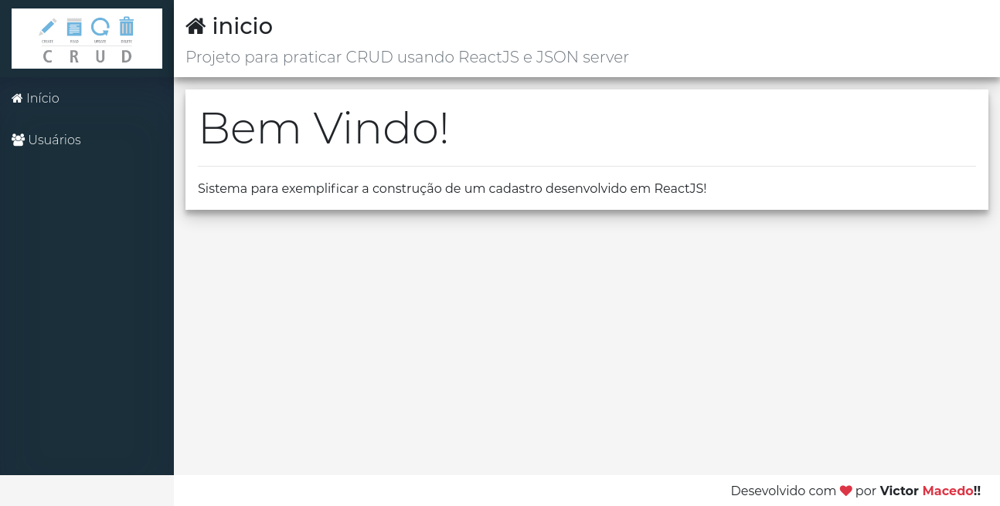
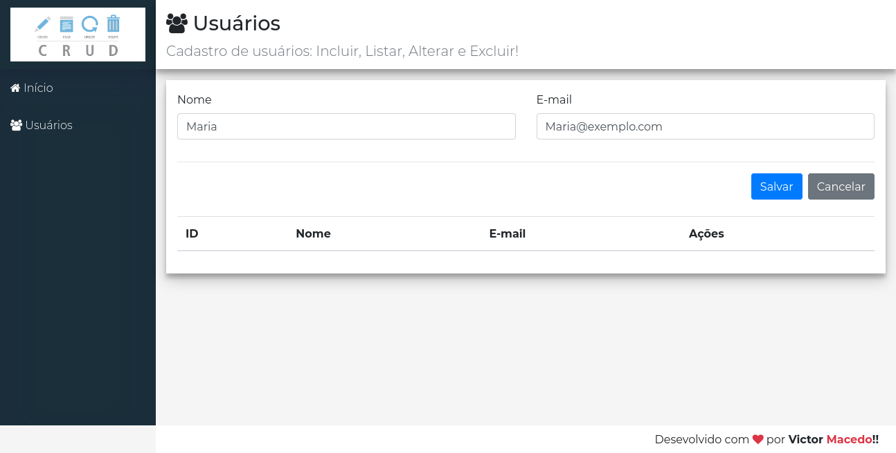
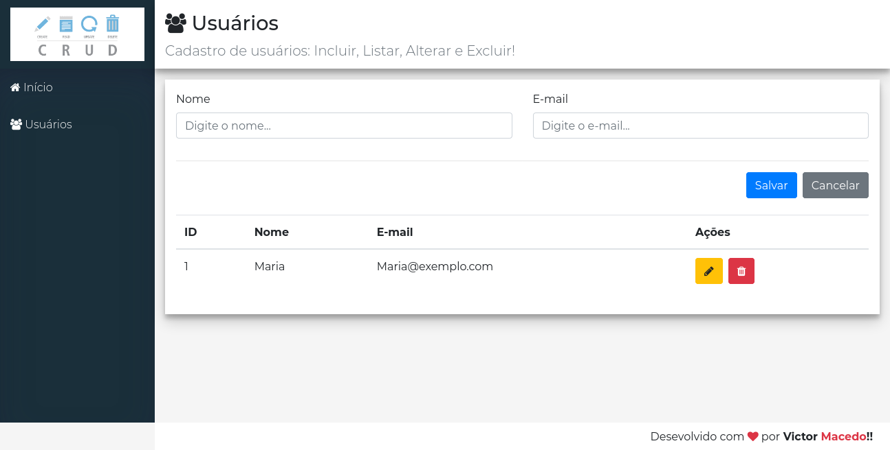
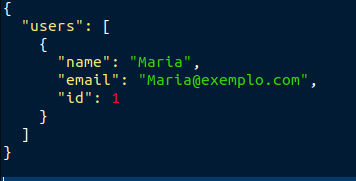

# basic-crud

### Motivação

Esse projeto foi criado com o objetivo de aprender mais sobre ReactJS e operações de CRUD com um banco de dados simples.

### Pré requisitos

- [NodeJS 14.17+](https://nodejs.org/en/)

### Instalação

- Clonar o repositório: `git clone https://github.com/victormacedo996/basic-crud`
- Entrar na pasta do projeto frontend: `cd basic-crud/frontend` e executar o comando para instalação das dependências: `npm install`
- Entrar na pasta do projeto backend: `cd basic-crud/backend` e executar o comando para instalação das dependências: `npm install`

### Execução

- Abrir dois terminais, um na pasta frontend e outro na pasta backend
- Em ambos os terminais executar o comando: `npm start`

### Tecnologias utilizadas

#### Frontend

- Axios
- Bootstrap
- FontAwesome
- ReactJS

#### Backend

- JSON server

### Páginas

Como layout básico todas as páginas tem os seguintes componentes:

- Menu lateral com logo do sistema e navegação para o início e para a página de cadastro
- Um menu superior para informar ao usuário onde ele está e uma breve descrição da página em que ele está

#### Index

- Card dando boas vindas ao usuário com uma pequena descrição da motivação do projeto

#### Cadastro do usuário

- Campo de input para que o usuário possa digitar nome e email do usuário a ser cadastrado
- Em caso das informações estarem corretas, ao clicar no botão salvar o nome e o email serão salvos no banco de dados

- Após a inserção do cadastro no banco de dados, a cadastro será exibido na mesma tela
- Ao lado do cadastro do usuário, existem dois botões, o amarelo para realizar a atualização do cadastro e o vermelho para deletar o cadastro

#### Modelagem do banco de dados

